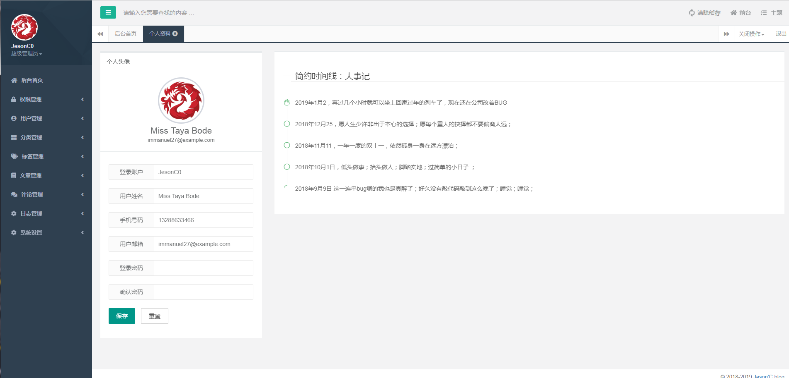
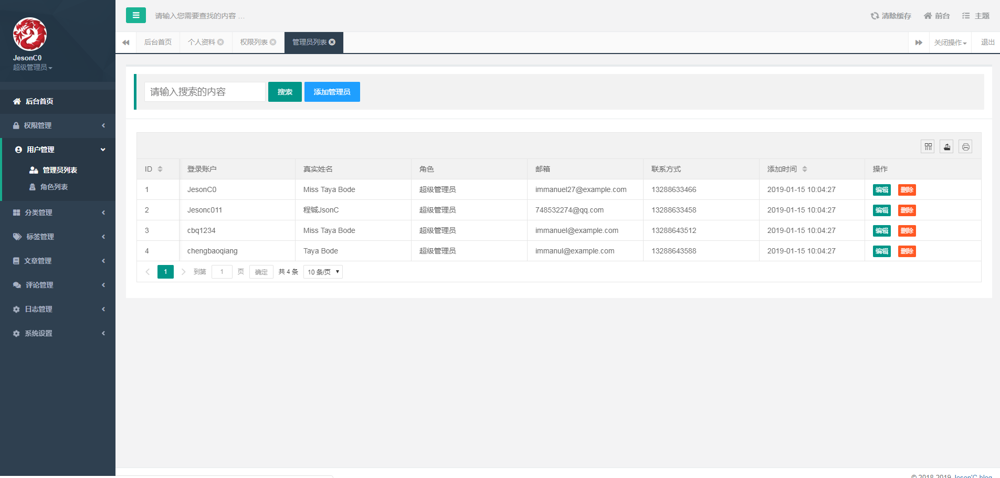
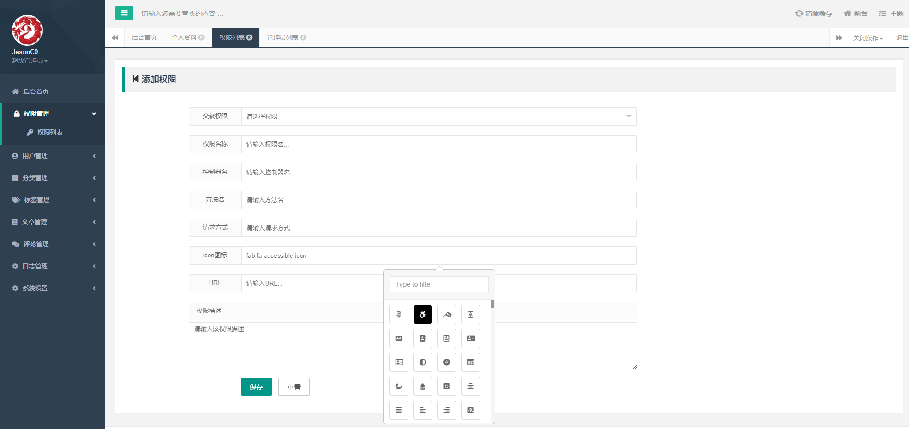
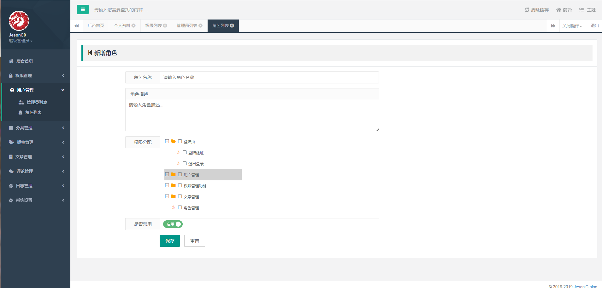
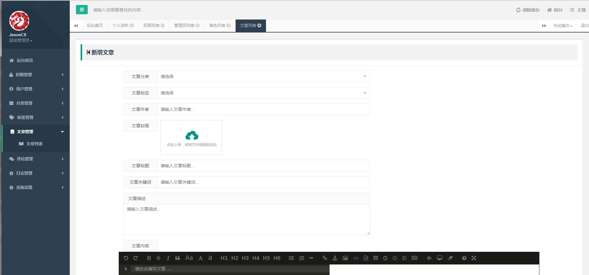
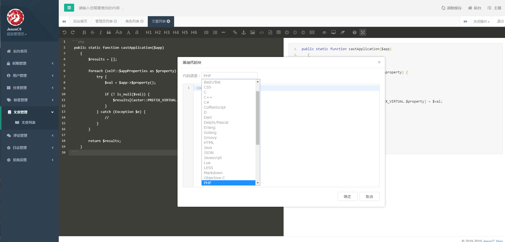

<p align="center"></p>

<p align="center">
<a href="https://travis-ci.org/laravel/framework"></a>
<a href="https://packagist.org/packages/laravel/framework"></a>
<a href="https://packagist.org/packages/laravel/framework"></a>
<a href="https://packagist.org/packages/laravel/framework"></a>
</p>

## About Laravel blog


Screenshots
------------












Requirements
------------
 - PHP >= 7.0.0
 - Laravel >= 5.5.0
 - Fileinfo PHP Extension

Installation
------------

> This package requires PHP 7+ and Laravel 5.5, for old versions please refer to [1.4](https://laravel-admin.org/docs/v1.4/#/)


```
git clone git@github.com:JensonHarris/laravel-blog.git
```
我们需要复制跟目录下的 .env.example 文件并重命名为 .env ；

```
cp .env.example .env  
```
我们需要在 .env文件中修改数据库配置；
```
DB_CONNECTION=mysql
DB_HOST=127.0.0.1
DB_PORT=3306
DB_DATABASE=homestead
DB_USERNAME=homestead
DB_PASSWORD=secret
```

使用 composer ；

```
composer install  
```
生成 key ；
```
php artisan key:generate  
```
生成数据表；
```
php artisan migrate  
```
生成初始化的数据；
```
php artisan db:seed    
```
